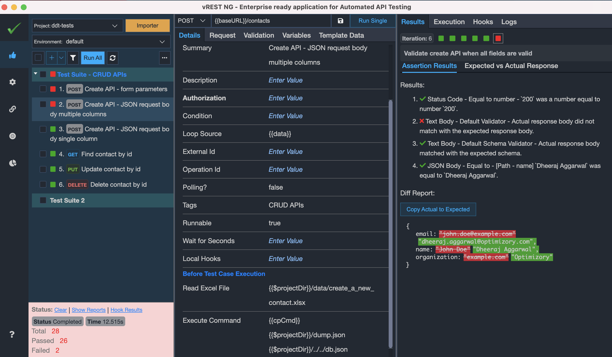
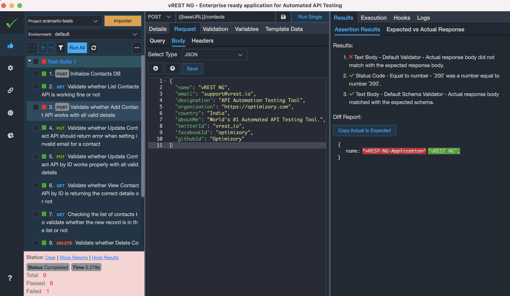

# Sample Test Application to demonstrate [vREST NG](https://vrest.io). #

Sample Test Application "**Contacts**" is a CRUD application built with with [Backbone.js](https://backbonejs.org/), [Bootstrap](https://getbootstrap.com/), [Node.js](https://nodejs.org/), [ExpressJS](https://expressjs.com/), and [LowDB](https://github.com/typicode/lowdb).

The application allows you to browse through a **list of contacts**, as well as **add**, **update**, **read** and **delete** contacts using the following APIs.

1. **POST** /contacts/rePopulateDB - Re-initialize the Database State
2. **GET** /contacts - Returns List of contacts
3. **POST** /contacts - Adds a new contact
4. **PUT** /contacts/{{contactId}} - Update the contact by id
5. **GET** /contacts/{{contactId}} - Read the contact by id
6. **DELETE** /contacts/{{contactId}} - Delete the contact by id

## Pre-requisites: ##
1. **NodeJS** (Tested with v10.16.2)

## To Run this application, simply follow the steps below: ##

1. Install the dependencies
```npm install```

2. Run the application server
```npm run start```

## Sample Projects written by vREST NG ##

The `test` directory contains the following sample **vREST NG** projects which you may drag in [vREST NG Application workspace area](https://vrest.io/docs/app/new-user.html) to see the test cases.

1. `ddt-tests`: This is a project written by vREST NG application to demonstrate the Data driven testing capability of vREST NG.

*vREST NG - Data Driven Testing Example*

2. `scenario-tests`: This is a project written by vREST NG application to demonstrate the Scenario or workflow testing capability of vREST NG.

*vREST NG - Scenario Testing Example*

3. `tests-using-npm-packages`: This is a project written by vREST NG application to demonstrate how you may import `npm` packages to extend the power of vREST NG Application. For more information, read this [guide link](https://ng.vrest.io/docs/app/utility-methods.html#importing-npm-packages-in-utility-methods).

*vREST NG - Use of NPM Package Example*

## Continuous Integration sample files ##

1. `Gitlab CI`: For Gitlab CI, use file `.gitlab-ci.yml`.
2. `Azure DevOps`: For Microsoft Azure DevOps, use file `azure-pipelines.yml`

**Note:** Before executing your tests, make sure your application server is running.