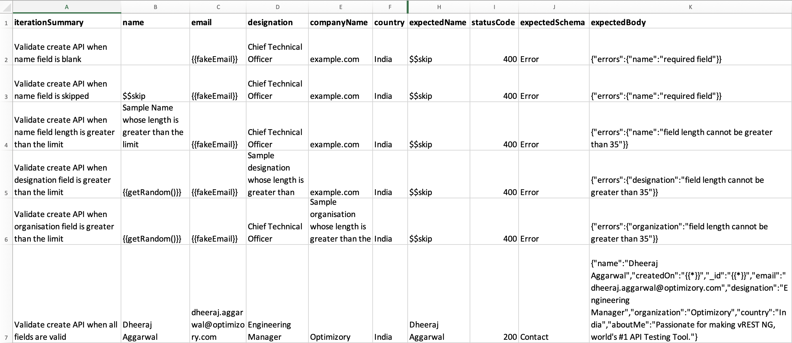

**This sample project works only with vREST NG (Pro Edition)**

*(You may use the 15 days trial period for Pro version. This is a sample project for performing Data Driven Testing using csv files and vREST NG.)*

# Data Driven Testing (using vREST NG) 

This project directory will demonstrate how you may use CSV files to feed data to various API end points to perform data driven testing.

vREST NG provides you the ability to perform one of the most productive approach in the world of testing. Data Driven Testing is an approach, which can save you a lot of time, effort, and other resources.

We have created this sample project using which you can easily get started with Data Driven Testing, just by importing this as a Project in your vREST NG Workspace.

Let us see how you can do that,

## Step 1 - Download & Install vREST NG
* First of all, you need to have vREST NG Application installed on your system.
* Download it from our [website](https://vrest.io) (for your OS).

## Step 2 - Clone this repository & run the sample test application
* You can clone this entire repository and keep it anywhere you want in your system. 
* And follow the instructions as specified at this [link](https://github.com/Optimizory/examples-vrest-ng).

## Step 3 - Open this `ddt-tests` directory as a Project in vREST NG
* Just add this project directory `ddt-tests` in your vREST NG Workspace.
* For more information on setting up project, you may look at this [guide link](https://vrest.io/docs/app/new-user.html).

* Now, you can explore this Project on your own.

## Step 4 - Switch the environment
* If you are working in Windows machine, then just switch the environment to `Windows` in the vREST NG application for this project.
* Otherwise keep the `default` environment.

## Step 5 - Enjoy the live editing of CSV file
* You may find the multiple CSV files inside the `data` directory. 
* Now you can make changes and simply save the csv file. The changes will get automatically reflected in vREST NG without any refresh or upload.
* Now you can click on  button available in left pane to run all the test cases.

Below is the sample screenshot of one of the CSV file:

## Benefits of Data Driven Testing

There are many unbelievable benefits from this simple, but effective, approach.

Let's see some of these benefits (some of these are confined to vREST NG):

* **Creates Separation of Concerns**: It has always been a problem for people like, **Automation Engineers** who don't want to handle a lot of Test Data or, **Manual Testers** who don't have the technical knowledge to write the automation logic by themselves. 

    Data Driven Testing solves this problem, because once you have separated the Test Data from the Automation Logic, then there will be two ways to see your testing framework:
    * **Automation Logic**: In vREST NG, your automation logic can be written in the form of test cases and for data inputs, you can leave variables, which will be used later.
    
    * **Test Data**: Once, you have made the test cases, you can bind an excel sheet document with it where you can store test data. You can apply multiple test scenarios here without even touching the automation logic.

This way you can separate the work of writing Test Data and Automation Logic, eventually saving a lot of time and effort. 

* **Does not require technical knowledge**: Writing test cases has always been really easy in vREST NG, but when there is minimal need to alter the test logic and just make changes in an Excel Sheet, this can be easily done by anyone who does not have a technical background.  

* **Real-Time Editing with Live Excel Sheet Integration** (only in vREST NG): vREST NG provides you ability to bind a data document (Excel Sheet, .numbers, .csv files) with a test case. Then, you can simply manage data in that data document, and the changes will be reflected in Real-Time in vREST NG. 

* **Highly Maintainable Test Cases**: Maintainability of your test cases is enhanced at a great level, because of the following two factors,
    * **Minimization of Test Cases**: You will have a very limited number of relevant test cases left, because now you don't have to create an individual test case for each type of test data input.
    * **Easy to make Changes**: Making changes in data becomes very easy because you just need to make changes in a data document (Excel Sheet, .numbers, .csv files), and you are not concerned with the test logic at all.

If you want to learn more about Data Driven Testing, then follow this [link](https://vrest.io/docs/app/methodologies/data-driven-testing.html).

## Frequently asked questions
1. I am getting `Access Denied` error while executing the sample data driven tests:

Our sample application uses a simple file based database. So in order to initialize the database state, vREST NG executes the `copy`/`cp` command to restore the database state before execution of every test. This command is written in the `Details` tab > `Execute command` field of every test. If you clone this repository in a directory, where vREST NG process don't have necessary permissions to change files then you will face such issue.
