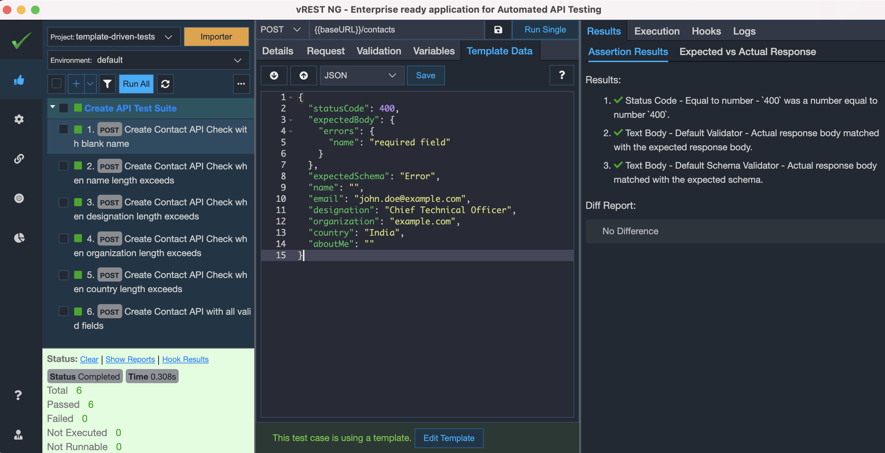

**This sample project works only with vREST NG (Pro Edition)**

*(You may use the 15 days trial period for Pro version. This is a sample project to demonstrate the template driven testing using vREST NG.)*

# Template based Testing (using vREST NG) 

This project directory will demonstrate how you may define API Templates to reuse the API requests to perform template driven testing in vREST NG Application.

We have created this sample project using which you can easily get started with template based Testing, just by importing this as a Project in your vREST NG Workspace area.

Let us see how you can do that,

## Step 1 - Download & Install vREST NG
* First of all, you need to have vREST NG Application installed on your system.
* Download it from our [website](https://ng.vrest.io) (for your OS).

## Step 2 - Clone this repository & run the sample test application
* You can clone this entire repository and keep it anywhere you want in your system. 
* And follow the instructions as specified at this [link](https://github.com/Optimizory/examples-vrest-ng).

## Step 3 - Open this `template-driven-tests` directory as a Project in vREST NG
* Just add this project directory `template-driven-tests` in your vREST NG Workspace.
* For more information on setting up project, you may look at this [guide link](https://ng.vrest.io/docs/app/new-user.html).

* Now, you can explore this Project on your own.

## Step 3 - Run the tests
* Now you can click on "Run All" button available in left pane to run all the test cases.

For more information on how you may perform template driven testing, please visit this [**guide link**](https://ng.vrest.io/docs/app/templates/).
